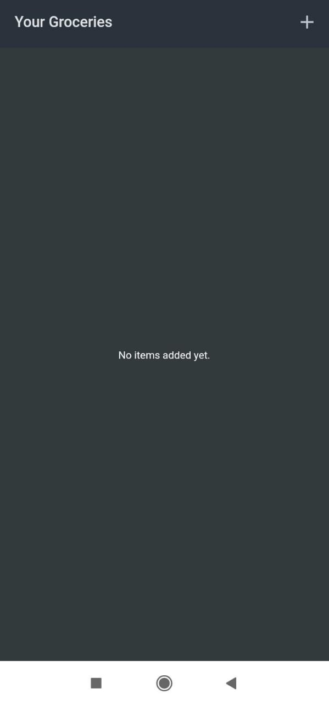
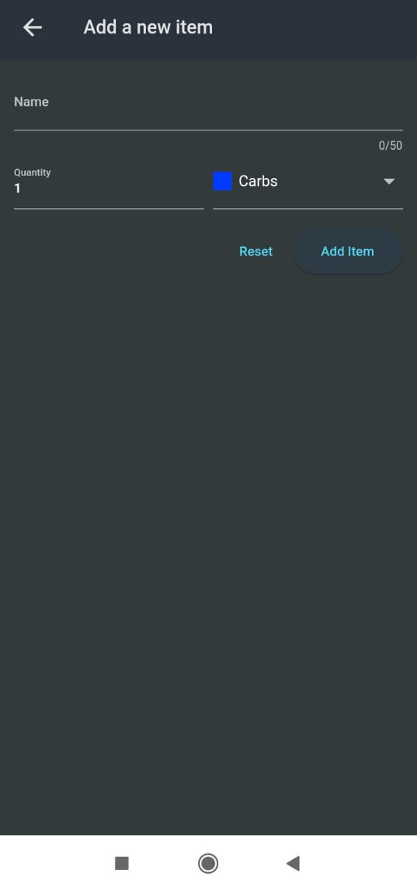
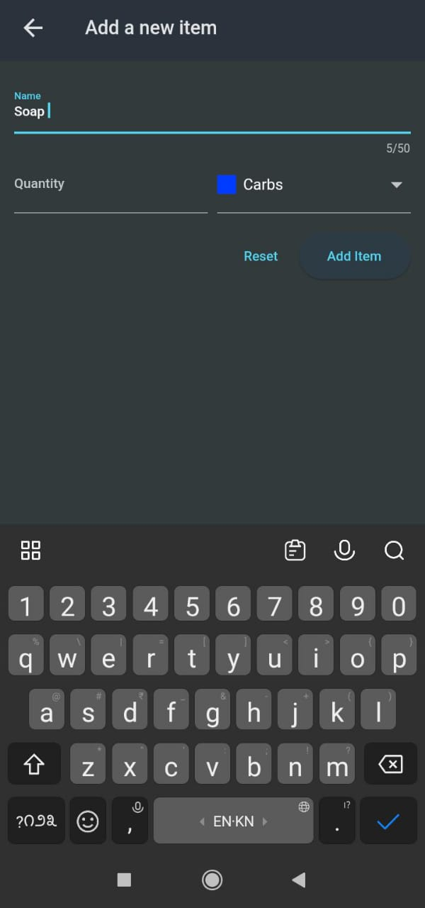
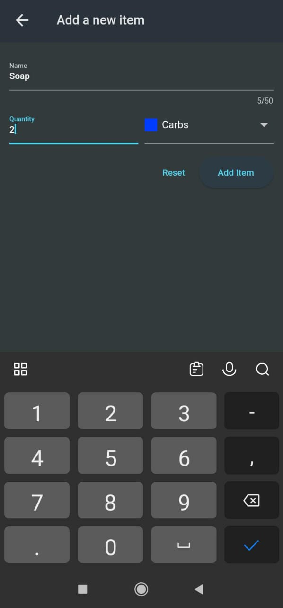
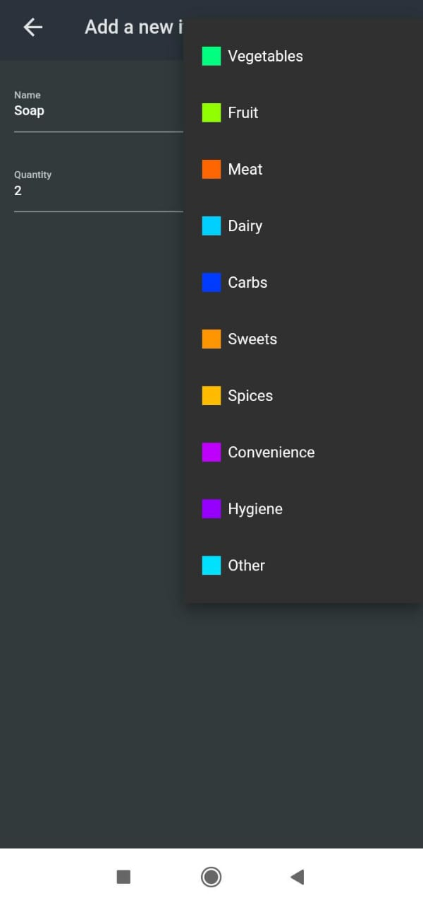

# Shopping List App

The Shopping List App is a mobile application built using Flutter. It allows you to keep track of items you need to buy by adding them to a shopping list.

## Features

- Add new items to the shopping list with a name, quantity, and type.
- View the list of all added items.
- Reset the entire list of items.
- Simple and intuitive user interface.

## Screenshots

<p >
    
    
  
  
  
</p>


## Getting Started

### Prerequisites

- Flutter SDK: [Install Flutter](https://flutter.dev/docs/get-started/install)
- Dart SDK (included with Flutter)

### Installation

1. Clone the repository:
    ```sh
    git clone https://github.com/aparnaprabhuu/Shopping-List-App.git
    ```
2. Navigate to the project directory:
    ```sh
    cd Shopping-List-App
    ```
3. Install dependencies:
    ```sh
    flutter pub get
    ```

### Running the App

1. Ensure a device is connected or an emulator is running.
2. Run the app:
    ```sh
    flutter run
    ```
